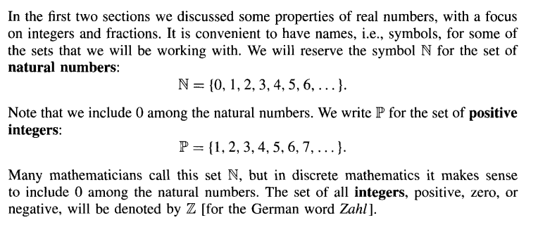
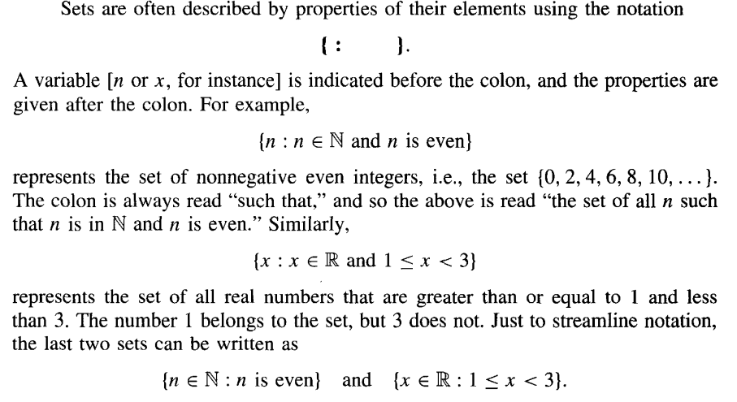
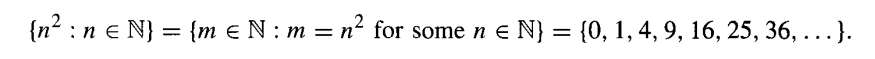

Topics covered:
- [Set Notation](set-notation) 
- [Reading Set Notation](reading-set-notation) 
- [General Sets and General Members of Sets](general-sets-and-general-memebers-of-sets) 
- [Advanced Set Notation](advanced-set-notation) 

# Some Special Sets

## Set Notation



### N

Refers to the set of all **natural numbers** (zero inclusive).

### P

Refers to the set of all **positive integers** (zero exclusive).

### Z

Refers to the set of all integers, (positive, zero or negative).

### Q

Refers to a set of rational numbers (a ratio of integers, or a fraction).

### R

Refers to a set of all real numbers; a combination of all of the above.

### ∅

Refers to an empty set.

### Element-of ∈

The element-of symbol is used to signify an object of a set. It can be read as "is an 
element of." An ∈ with a strikethrough is usually the opposite, "is not an element of."

## Reading Set Notation



**The : can be read as "such that" or "where".** 
```
{n : n E N and n is even}
n where n is a natural number and n is even
```



```
(n^2 such that n is a natural number) =

(m is an element of natural numbers such that m = n^2 for some of n
being a natural number) =

a set of (0, 1, 3, 9, 16, 25, 36, ...)
```

### General Sets and General Members of Sets

Typically, generic sets are denoted by a capital letter, such as (*A, B, S
or X*).

For elements of a set, a generic member in other words, is denoted using a the lowercase
of corresponding set.

For example, s ∈ S or t ∈ T. 

## Advanced Set Notation

### Subset ⊆

The subset-of symbol ⊆ can simply be read as "A is a subset of B"
> Subset-of may also be read as "is contained in".

Consider S ⊆ T. Since s ∈ S, this implies that s ∈ T.

### Power Set

The set of all subsets of a set of S is a power set and can be denoted as P(S).
> You may think of a power set as an array within an array.

Consider the following example to see how power sets work:


In essence, power sets list out all the possibile combinations of any given set.
And in point (d), if the finite set has n elements where n <= 3, there will
be 2^n elements (or combinations) in the power set.

### Sigma Σ

Sigma sets aren't much different from generic sets, the idea is the same except instead of
having numberic elements, sigma sets consist of **letters**.

One could define the alphabet within Σ, such that

`Σ = {a, b, c, d, ... , z}`

### Sigma Star Σ*

Essentially, the super set of sigma (Σ), sigma star  
