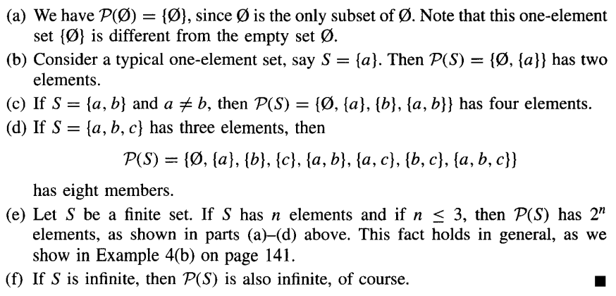
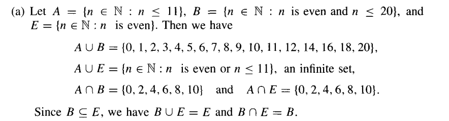
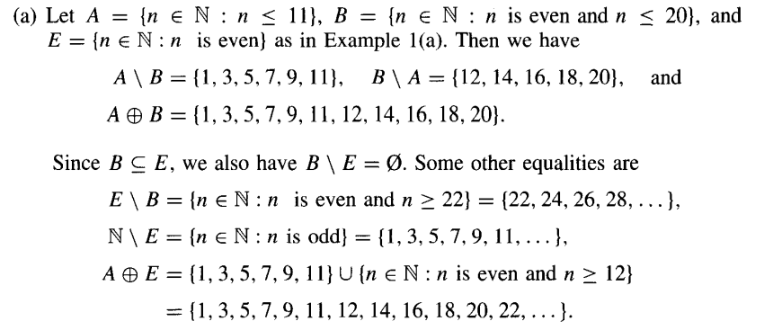
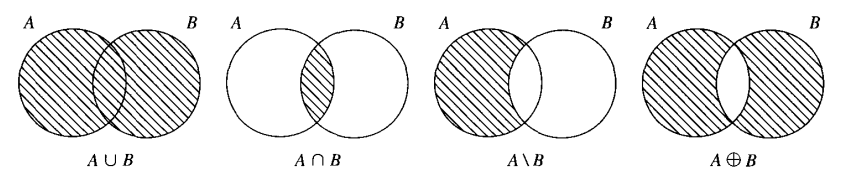
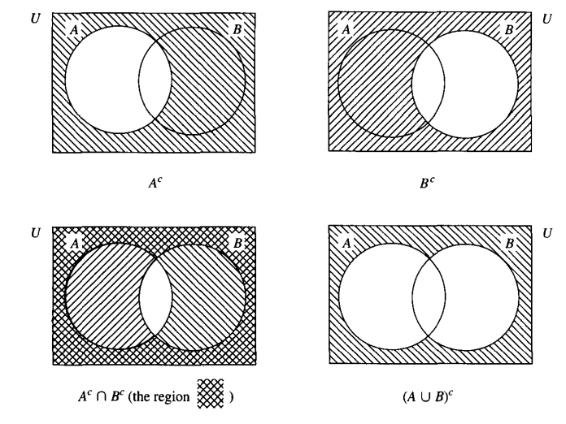
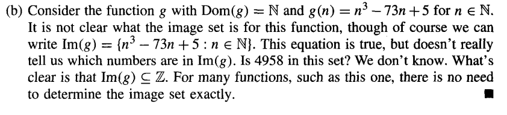
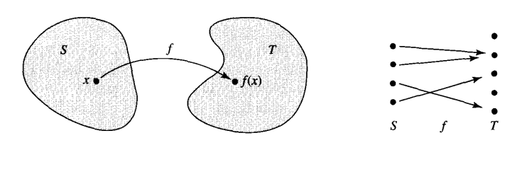
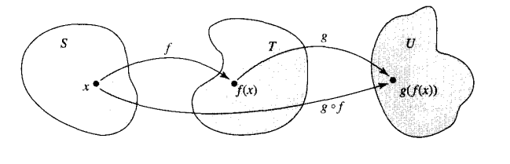
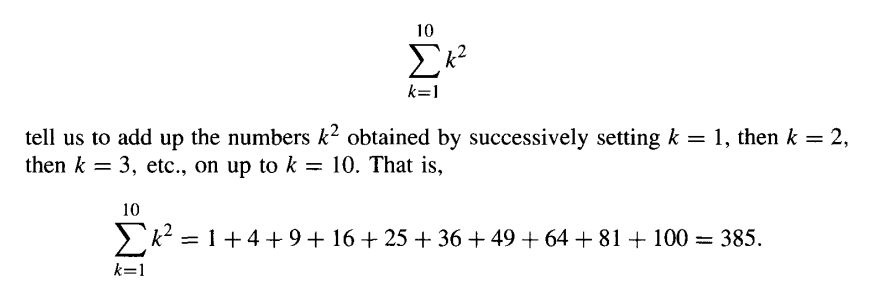

Sections covered:
- [1.3 Some Special Sets](#special-sets) 
- [1.4 Set Operations](#set-operations) 
- [1.5 Functions](#functions) 
- [1.6 Sequences](#sequences) 

# Some Special Sets

### Set Notation

| Symbol   |  Meaning  |
|--------------- | --------------- |
| $\mathbb{P}$  | Positive integers (zero exclusive) |
| $\mathbb{N}$  | Natural numbers (zero inclusive) |
| $\mathbb{Z}$  | Real numbers (positive, negative, or zero) |
| $\mathbb{Q}$  | Quotient numbers (fractions) |
| $\mathbb{R}$  | All numbers |
| $\empty$  | Empty set |

### Element-of $\epsilon$

The element-of symbol is used to signify an object of a set. It can be read as "is an 
element of." An $\epsilon$ with a strikethrough is usually the opposite, "is not an 
element of."

### General Sets and General Members of Sets

**Generic sets** are denoted by a capital letter, such as (*A, B, S
or X*).

The **generic members** of the set, the individual elements, are denoted via lowercase
letters (*a, b, s, or x*).

For example, s $\epsilon$ S or t $\epsilon$ T. 

### (Improper) Subset $\subseteq$ 

Consider $A \subseteq B$. This can simply be read as "A is a subset of B"
> Note: Subset-of may also be read as "is contained in".
> Also: This symbol is an IMPROPER subset, not a PROPER subset ($\subset$).

Now consider $S \subseteq T$: Since $s \epsilon S$, this implies that $s \epsilon T$.

### Power Set

The set of all subsets of a set of S is a power set and can be denoted as P(S).

The total size of a power set will generally be $2^n$ size.

### Sigma $\sum$

Sigma sets can contain any combination of letters, numbers and symbols.

We could define the alphabet within $\sum$, such that

$\sum = {a, b, c, d, ... , z}$

### Sigma Star $\sum*$

A "super set" of sigma, sigma star contains all combinations of a sigma set.

Since there's an infinite number of ways to combine letters and symbols, sigma star
is infinite in size.

##### Lambda $\lambda$
The first letter of sigma star, lambda simply represents an empty word.

### Restrictions of Sigma

Sigma sets are not allowed to contain elements of strings which **begin with the 
same letter as an existing element**. 

We can allow $\sum = {a, b, c}$, however we cannot allow $\sum = {a, b, c, cd}$

 

## Set Operations

> $x$ may be any member of sets $A$ and $B$

### Union $\cup$

$A \cup B = (x : x \epsilon A$ *OR* $x \epsilon B)$

$A$ unites $B$ such that $x$ is an element of $A$ or $B$. 

All elements in A or B

### Intersect $\cap$

$A \cap B = (x : x \epsilon A$ *AND* $x \epsilon B)$

$A$ intersects with $B$ such that $x$ is an element of $A$ and $B$ simultaneously. 

All elements in A and B

##### Example 

> A and B are said to be **disjoint** should they have no elements in common
> $A \cap B = \empty$

### Relative Compliment $\backslash$
> Relative in the sense that we are only concerned in two particular sets.

$A \backslash B = (x : x \epsilon A$ *and* $x !\epsilon B)$

If $x$ is in $A$, but $x$ is NOT in $B$, $A$ and $B$ are relative compliments.

All elements in A that are not in B

### Symmetric Difference $\oplus$

$A \oplus B = (x : x \epsilon A$ *or* $x \epsilon B)$, *but not both!*

$x$ is an element of $A$ or $B$, but it cannot be an element of both.

All elements in A or B that are not in both.

##### Example 

### Universe $U$

A Universe is a combination of all elements across all sets, denoted by U.

### Absolute Compliment $A^c$
> Otherwise known simply as the "compliment" of a set.

$A^c = (x \epsilon U : U \backslash A)$

All the elements in universe that are not present in A.

### Venn Diagrams

It is can be useful to have a visual representation of how set operations relate one
set to another.

##### Example (a)

##### Example (b)

### Rules of Set Operations

$$
A \cup B = B \cup A
$$

$$
A \cap B = B \cap A 
$$

$$
A \oplus B = B \oplus A
$$

$$
A \backslash B \neq B \backslash A
$$

These rules are the same rules as the assosciative and complimentary examples.

Furthermore:

$$
A^c \cap B^c = (A U B)^c
$$

Both expressions can be read as: All elements that are not in A and B.

### Product Sets and Ordered Pairs

$$
S * T = {(s, t) : s \epsilon S, t \epsilon T}
$$

### Finite Set (Length of Set) $|A|$

$$
|\empty| = 0
$$ 

$$
|{1, 2, ... , n}| = n : n \epsilon P
$$

$$
|U| = (|A| \cup |A^c|) \cup (|B| \cup |B^c|) \cup ...
$$

 

# Functions

Functions in discrete math are **defined of set A** with **values in set B**.

Set A is considered the domain of the function and can be written as **Dom(f)** (and 
it often is).

For every x in Dom(f), f(x) is called the image of x under f. The set of all these 
images is a subset of B called the image of f, written as **Im(f)**

$$
Im(f) = { f(x) : x \epsilon Dom(f) }
$$
> Im(f) is a set of f(x) such that x is an element of Dom(f) (or set A)

##### Example

## Image $Im(f)$

For every x in $Dom(f)$, $f(x)$ is called the image of x under $f$. We can put these 
transformations together to make an **image set** $Im(f)$, **or the set of
all values taken by the function f(x)**.

$$
Im(f) = { f(x) : x \epsilon Dom(f) }
$$
> Im(f) is a set of f(x) such that x is an element of Dom(f) (or set A)

### Map

Sometimes, functions are refered to as **maps**. This is because the behavior of a 
function $f$ **maps** S into T.

## Codomain

Codomains are a **set of images which derive from S after a transformation of $f$**.
In other words, they are the output after a transformation of $S$

$$
f : S \rightarrow T
$$
> This is read as "$f$ is a function with domain S and codomain T".

### Graph $G$

A function with domain S and codomain T may be graphed, or a subset of G, such that;

for each $x \epsilon S$ there is exactly one $y \epsilon T$ such that
$(x, y) \epsilon G$

## Characteristic Fucntion $\chi A$

Characteristic functions contain unique elements such that x meets a condition; these 
functions behave much like piecewise functions in Algebra.

$$
\chi A = \left\{\begin{array}{rcl} 1 & if & x \epsilon A, \\
0 & if & x \epsilon S \backslash A. 
\end{array} \right.
$$

For computers in particular, characteristic functions are particularly useful, as they 
can describe subsets of characteristic elements with bits 0 and 1.

## Composition Functions $g(f(x))$ 

We can compose two functions if we invoked a transformation such as S to T, and T to U.
This is moreso for brevity.

$$
(g \circ f) : S \rightarrow U
$$

$$
(g \circ f)(s) = g(f(s))
$$

#### Example

### Assosciative Property of Functions

Functions are assosciative:

$$
h \circ (g \circ f) = (h \circ g) \circ f
$$

This is because no matter what order you compute the function expressions,
you'll always end up with the same result.

# Sequences

Sequences are sets which can be infinitely large in size.

## Sum $\sum$

