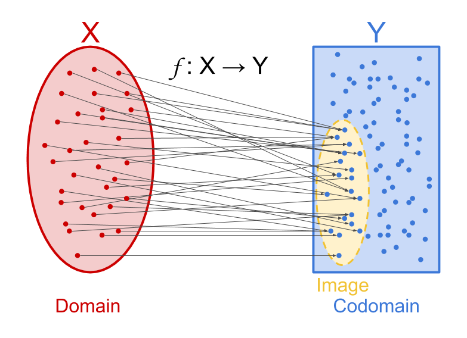

Sections covered:
- [1.3 Some Special Sets](#special-sets) 
- [1.4 Set Operations](#set-operations) 
- [1.5 Functions](#functions) 
- [1.6 Sequences](#sequences) 
- [1.7 Properties of Functions](#properties-of-functions)

# Some Special Sets

## Set Notation

| Symbol        | Meaning                                    |
|---------------|--------------------------------------------|
| $\mathbb{P}$  | Positive integers (exclusion of 0)         |
| $\mathbb{N}$  | Natural integers (inclusion of 0)          |
| $\mathbb{Z}$  | All integers (positive, negative, or zero) |
| $\mathbb{Q}$  | Quotient numbers (fractions/decimals)      |
| $\mathbb{R}$  | All real numbers                           |
| $\emptyset$   | Empty set                                  |

### General Sets and Members

Sets are denoted via capital letters, such as $A$ or $B$. They contain any 
number of elements, or members, which make it a set.

Members of these respective sets, are denoted via the lowercase equivalent.
For example, $a \in A$ and $b \in B$.

## Element-of $\in$

Signifies that an **element is in a set**, or an element of a set.
In plain English, $\in$ can be read as "in". For example, $x \in X$ would 
translate to "$x$ in set $X$"

$\notin$ signifies the opposite: $x \notin A$ translates to "$x$ not in
set $A$"

## Subset $\subseteq$ 

Suppose we had the two following sets, $A$ and $B$: 

$A = \{1, 2, 3\}$, and $B = \{1, 2, 3, 4\}$

In this case, we could say that $A \subseteq B$. This translates to "set $A$ is 
a subset of set $B$."

This just means that set $A$ is made up of elements in a larger set $B$.

As an aside, since $A \subseteq B$, this implies that $a \in B$, because again, 
we could see that all elements of $A$ derive from $B$

## Power Set $\mathcal{P}(S)$

To preface, its important to note that **sets can contain anything**, it isn't 
exclusive to numbers: You could have a set of characters, strings, even sets 
themselves can be elements of a set.

Power sets are just that: Large sets containing smaller sets as its elements. 

To put it simply, $\mathcal{P}(S)$ is a **special set** which consist **of all
possible subsets** of a given set, $S$.

$\mathcal{P}(S)$ tends to be very large due to having a size of $2^n$, where 
$n$ is the number of elements in $S$.
> In symbolic notation, we could simply say that $n = |S|$.  
> $|S|$ just means "number of elements in $S$"

### Examples from the Textbook

## Sigma $\Sigma$

Remember, sets can contain anything.

$\Sigma$ is yet another special set which contains unique elements, that being
any combination of letters, numbers and symbols.

For example, we could define the English alphabet as the following:

$\Sigma = \{a, b, c, d, ... , z\}$

### Restrictions of $\Sigma$

Sigma sets are not allowed to contain more than one word which begins with the
same letter. 

For example, we can allow $\Sigma = \{a, b, c\}$

However, we cannot allow $\Sigma = \{a, b, c, cd\}$, because $c$ and $cd$ begin 
with the same letter.

## Sigma Star $\Sigma^*$

In short, $\Sigma^*$ consists of all the possible combinations of symbols in
$\Sigma$. The elements of $\Sigma^*$ are commonly denoted as "words," and 
$\Sigma^*$ itself is denoted as a "language." 

For example, suppose we had the alphabet 

$\Sigma = {a, b, c, d, ... , z}$

The language, or $\Sigma^*$, derived from the alphabet contains infinitely many
words. For example, $\{cat\} \in \Sigma^*$. 
> Generally, most words in a language aren't coherent words  
> $\{ababacdcd\} \in \Sigma^*$ is true, for example.

An easy way of thinking about $\Sigma^*$ is $\mathcal{P}(\Sigma)$, or the power 
set of $\Sigma$. This is because power sets and $\Sigma^*$ behave quite similarly
in practice.

### Lambda $\lambda$

The first word of any language is always $\lambda$, which simply represents an
empty word.

$\Sigma^* = \{\lambda, ...\}$

 

# Set Operations

| Symbol       | Notation              | Meaning                                       |
| ------------ | --------------------- | --------------------------------------------- |
| $\cup$       | Union                 | All elements in A **or** B                    |
| $\cap$       | Intersection          | All elements in A **and** B                   |
| $\backslash$ | Relative Compliment   | All elements in A **that are not** B          |
| $\oplus$     | Symemetric Difference | All elements in A **and** B, **but not both** |

## Universe $U$

The universe encompasses everthing. For example, $U = \Sigma^*$ or $U = \mathbb{R}$.

All sets are inherently a subset of the universe.

## Absolute Compliment $A^c$

The formal definition is as follows:

$A^c = \{ x \in U : U \backslash A \}$

In other words, the **compliment** of a set $A$ is a set containing **everything 
outside of $A$**.

## Venn Diagrams

It is can be useful to have a visual representation of how set operations relate one
set to another.

##### Union, Intersection, Relative Compliment, and Symemetric Difference

##### Universe and Relative Compliment

## Rules of Set Operations

$$
A \cup B = B \cup A
$$

$$
A \cap B = B \cap A 
$$

$$
A \oplus B = B \oplus A
$$

$$
A \backslash B \neq B \backslash A
$$

For the most part, set operations behave much like arithmetic operations; union, 
intersection, and exclusive or (symemetric difference) follow commutative properties.

Furthermore:

$$
A^c \cap B^c = (A \cup B)^c
$$

## Product Sets and Ordered Pairs

If we have two sets $X$ and $Y$, we can conjuct the two sets to create ordered pairs 
of their respective elements using the $*$ symbol.

$X * Y = \{(x, y) : x \in X, y \in Y\}$

$X * Y$ is a set populated by ordered pairs of the form $(x, y)$.

## Finite Set $|A|$

Finite sets simply predefine the number of elements in a given set.

$$
|\emptyset| = 0
$$ 

$$
|{1, 2, ... , n}| = n : n \in P
$$

$$
|U| = (|A| \cup |A^c|) \cup (|B| \cup |B^c|) \cup ...
$$

 

# Functions

Functions are **defined of elements in set A** with the output **lying in set B**.

Basically, $f$ transform set $A$ to become set $B$. Formally, this relationship is 
written as:

$f: A \rightarrow B$

## Domain $Dom(f)$

In mathematics, **the domain is known simply as the input**.

$Dom(f)$, or the domain of a function, is whatever set is being **targeted**.

Suppose we had the function $f: A \rightarrow B$. Since set $A$ is being targeted 
by $f$, set $A$ is our input, a.k.a, our domain.

$f: A \rightarrow B \implies Dom(f) = A$

> Since $f$ is acting upon $A$ to output $B$, this implies ($\implies$) $A$ is our
input. 

## Image $Im(f)$

We understand that the input we feed to a function is its domain, but what about the 
output? Simple, **the output of a function is known as the image**.

$Im(f)$ is just another special set like $Dom(f)$, except **it's populated with all 
the output values derived from the input values**.

Symbolically, this would be represented as $f(x)$ values.

The formal definition of an image set is as follows:

$Im(f) = \{ f(x) : x \in Dom(f) \}$

## Codomain

Codomains are easy to confuse with $Im(f)$, though **it's important to note that they
are not the same**. In fact, $Im(f) \subset Cod(f)$.

Codomains are sets **containing any *POSSIBLE* outputs which derive from the codomain**.

$Im(f)$ only consists of output corresponding to whatever output we give to $f$, but 
there are far more possible output values to $f$ than what we give it.

$f: A \rightarrow B \implies Cod(f) = B$
> Since $f$ is acting upon $A$ to output $B$, this implies that all of our output lies
in $B$. 

## Maps

Consider $f: S \rightarrow T$

Because functions produce an output following a given input, this means that we are 
essentially "mapping" elements of $S$ onto $T$.

The following diagram is a great example of maps, since they are primarily visual 
tools, much like graphs.

### Graph $G$

A function with domain X and codomain Y may be graphed, or a subset of G.

Consider the following product set and function:

$f: X \rightarrow Y$

$X*Y = \{(x, y) : x \in \mathbb{N}, y \in \mathbb{N} \}$ 

For each $x \in X$ there is exactly one $y \in Y$ such that $(x, y) \in G$.

$X*Y \subset G$

## Characteristic Function $\chi_A$

Characteristic functions produce a given output upon meeting a certain condition.
They are always denoted as $\chi_A$.

Think of piecewise functions, which in of themselves are characteristic functions.

$$
\chi_A = \left\{\begin{array}{rcl} 1 & if & x \in A, \\
0 & if & x \in U \backslash A. 
\end{array} \right.
$$

## Composition Functions $g \circ f(x)$ 

Not all function need be the same. We could always declare a function $f$ and 
another function $g$.

In some cases, we may want to combine the two. Consider the following functions:

$f : S \rightarrow T, \ g : T \rightarrow U$

If we wanted to compose $f$ and $g$, we would get the following:

$(g \circ f) : S \rightarrow U$

#### Example from the Textbook

### Note: Assosciative Property of Functions

Functions are assosciative. This means that no matter which way you choose to
compute a composite function, you will always end with the same result.

$$
h \circ (g \circ f) = (h \circ g) \circ f
$$

 

# Sequences

Sequences are algebraic concepts such that a transformation, $f$, is invoked on 
$n$ amount of elements.

For example, $n!$ is a sequence of $\mathbb{N}$ such that

$n! = n * n-1 * n-2 ... 3 * 2 * 1$ 

## Sum $\sum$

Another example of a sequence is summation.

 

# Properties of Functions

## One-to-One

Every element s hits a member of T exactly once.

Def: A function $f : S \rightarrow T$ is *one-to-one* if each element $s$
corresponds to any $t$ value **once at most**.

If $s1 \neq s2$, then $f(s1) \neq f(s2)$ 

Else if $f(s1) = f(s2)$, then $s1 = s2$ 

## Onto 

Every element s hits a member of T.

Def: A function $f : S \rightarrow T$ is *onto* $Im(f) = T$ for all $t \in T$
such that $f(s) = T$

## One-one Correspondance

Every member of set S corresponds to every member of set T.

Def: A function $f : S \rightarrow T$ is a *one-to-one correspondance*
if $f$ is one-one and onto.

## Inverse Functions

Def: Let $f : S \rightarrow T$ be a function. A inverse function of $f$ is
the function $f^{-1}: T \rightarrow S$

For all $s \in S, f^{-1}(f(s)) = s$ 
