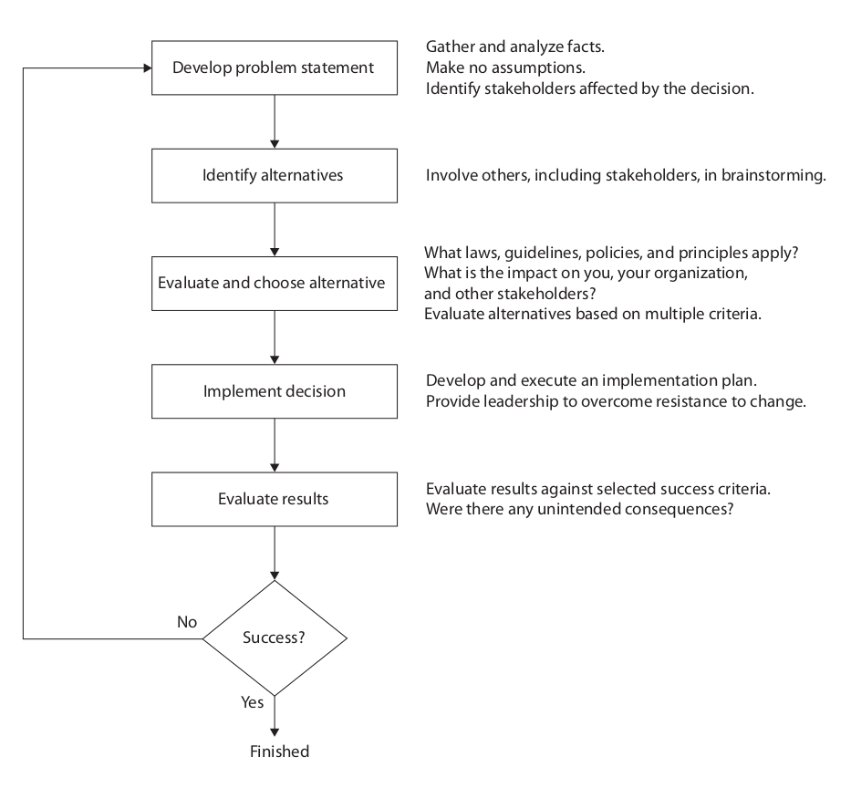

# Chapter 1: An Overview of Ethics

### What is ethics, and why is it important to act according to a code of ethics?

A **code of ethics** is a statement that highlights an organization's key ethical issues
and identifies the overarching values and principles that are important to the
organization and its decision making.

The cornerstone of ethical behavior is **integrity**, which is basically treating
others with respect as you would expect for yourself.

It's important to act according to a code of ethics because the consequences of
falling out of line of the code could not only put yourself at harm, but others as
well.

### Why is business ethics becoming increasingly important?

Business ethics are becoming increasingly important because there is a trend of
increasingly unethical behavior withing the realm of business.

Some controversial practices in business tend to be:

- Offshoring overseas in order to exploit immoral working conditions in third-world
countries

- A recessionary economic climate incentivizes organizations to maintain revenue
and profits; the prioritization of the bottom-line over employee's.

- Poor accounting standards.

 

With that said, there's a lot to gain with good business ethics:

| Perks of Good Business Ethics |
| ------------- |
| Gaining the good will of the community |
| Creating an organization that operates consistently |
| Fostering good business practices |
| Protecting the organization and its employees from legal action |
| Avoiding unfavorable publicity |

- Gaining the good will of the community
    - These companies will find it easier to compete for the best job candidates.
    - Adverse publicity impedes business realtions and sales.

- Creating an organization that operates consistently
    - Operate according to standards of ethical conduct, in words and action.

- Fostering good business practices
    - Good ethics can mean good business and improved profits
    - Bad ethics can have a negative impact on employees, many of whom develop
    bad attitudes if their values differ from the organization's actions.

- Protecting the organization and its employees from legal action
    - Fines for criminal violations can be lowered by up to 80% if the organization 
    implements ethics management programs and cooperates with authorities.

- Avoiding unfavorable publicity
    - Public reputation of a company strongly influences the value of its stock.

### What are organizations doing to improve their business ethics?

By implementing ethics management programs.

**Corporate ethics officers** provide an organization
with vision and leadership. They emphasize the importance of ethics and ideally 
report directly to the CEO.

The **board of directors** are responsible for management of an organization. They
are the ones to oversee business activities for the benefit of stakeholders (employees,
shareholder, customers, suppliers, and the community).

### Why are organizations interested in fostering good business ethics?

Fostering good business ethics is a good idea because the value of a company's stock
is influenced by public reception. Enforcing good business ethics results in a better
outlook of the company and better publicity, raising the price of stock.

It also comes back to the idea of integrity, and companies are implementing several
ways in order to maintain integrity.

Conducting **social audits** show how well a company is meeting its ethical 
and social responsibility of goals. This information is shared with stakeholders and 
the government.

### What approach can you take to ensure ethical decision making?

*Fairness Approach* 
Focus on how fairly actions adn policies distribute benefits and burdens among people
affected by the decision.

*Common Good Approach* 
Making decisions based on a vision of society as a communtiy whose memebrs work 
together to acheive a common set of values and goals.

### What trends have increased the risk of using information technology in an unethical manner?

The breakthrough of technology in the modern world as it becomes the new norm leaves
tech at risk of being used unethically, especially since it is so ingrained within 
our daily lives.

A couple of ways in which technology may be abused for unethcial means are the
following:

| Unethcial Uses of Technology |
| ------------- |
| Monitoring of email and Internet while at work; invasion of privacy |
| Piracy of copyrighted material |
| Spam email as a low-cost marketing approach |
| Hackers breaking into databases to steal customer information |
| Plagirizing work |
| Websites planting cookies or spyware on site visitors to track online activities |

